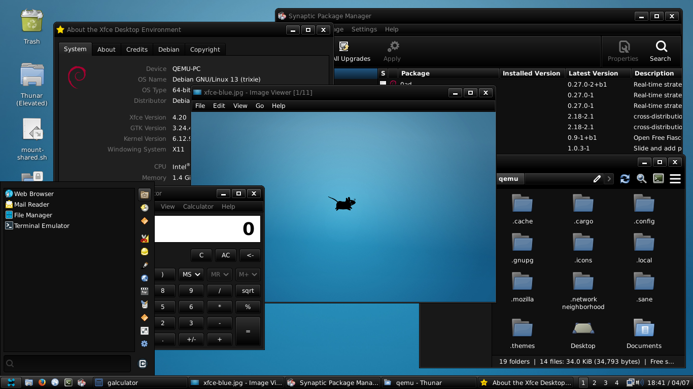

# Blackstone
A dark GTK theme with some gradients, using Mint-Y as a base theme.

(Using tweaked `~/.config/gtk-3.0/gtk.css` for the panel.)

## Toolkits
- GTK Murrine Engine
- GTK 3
- GTK 4

## Installation
Manually clone the theme and put the folder to `~/.themes/`.
