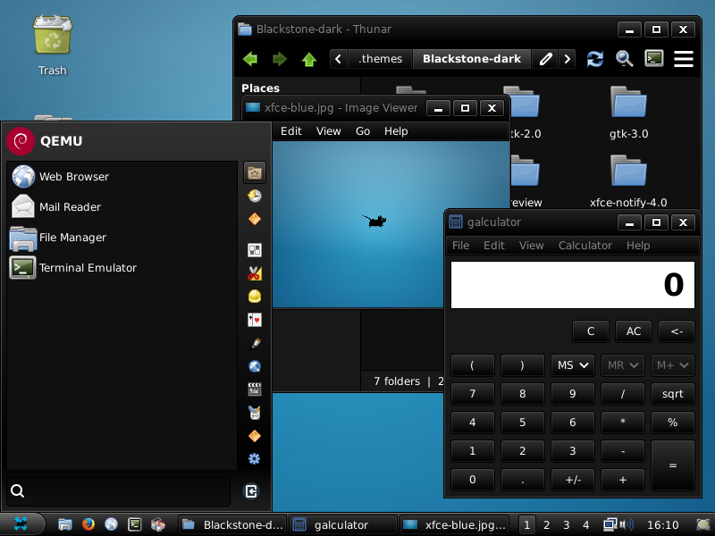
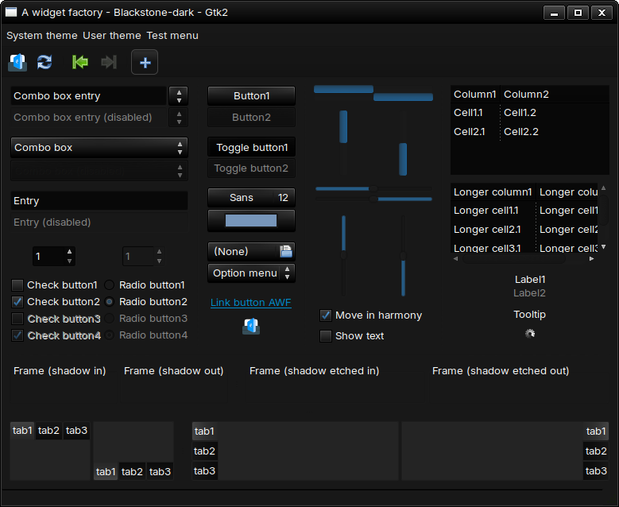
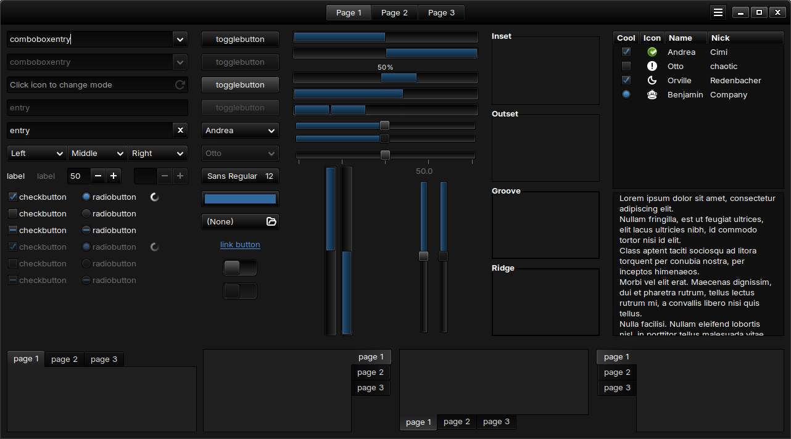
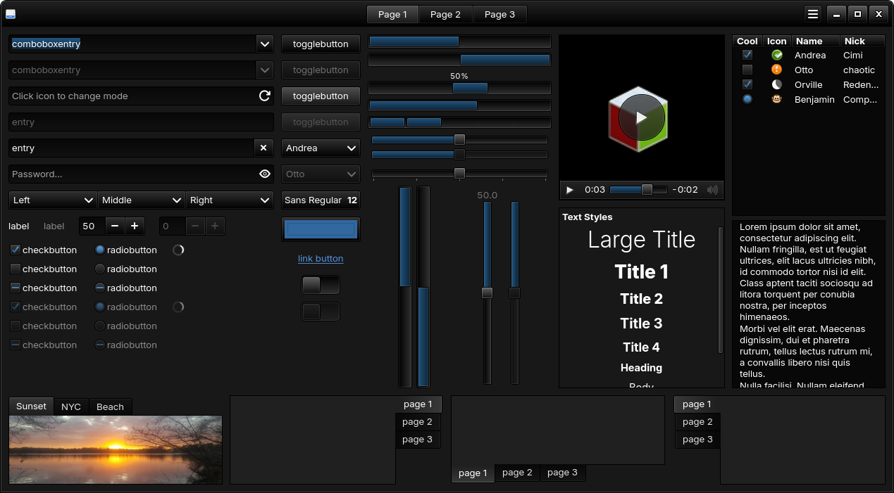

# Blackstone
A dark GTK theme with some gradients, using Mint-Y as a base theme. This theme is optimized for XFCE, and haven't been tested on other environments (e.g. MATE, Cinnamon).

(Using tweaked ~/.config/gtk-3.0/gtk.css for the panel.)

## Toolkits
- GTK Murrine Engine
- GTK 3
- GTK 4

## Installation
Clone the git and copy/move the folder to:
- User: `~/.themes/`
- System: `/usr/share/themes/`
- Panel styling: Copy/move `./additional-styling/gtk.css` to `~/.config/gtk-3.0/`
> [!WARNING]
> Copying the panel styling to the `~/.config/gtk-3.0` will delete/override your `gtk.css`! Backup your current `gtk.css`, copy the `./additional-styling/gtk.css` or copy the contents to your `gtk.css`.

## Toolkit/Widget Previews
> [!NOTE]
> - The image previews you're seeing is using the font `Inter 10pt` and my own icon theme `Tango-extra` (mainly title bar icons on CSDs) for this preview. Title bar icons may fall back to generic `hicolor` icons or whatever the currently applied icon theme.
> - This GTK 2 theme came from this "pre-rewrite/legacy" theme and now it's in "maintenance" state, where it only needs fixing when an element has unreadable spot.
> - "Blackstone-dark" is just a link to the "Blackstone" theme, fixing the color schemes to light on libadwaita applications and some other GTK applications that got reverted to `Adwaita-dark` on my main machine.

A widget factory (GTK 2)

GTK 3 Widget Factory

GTK 4 Widget Factory

